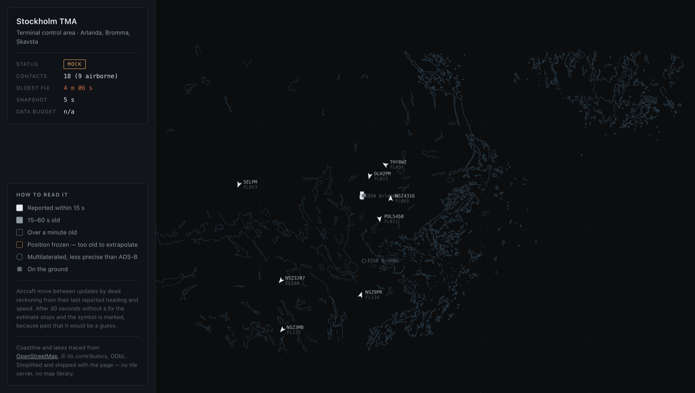

# Stockholm TMA

**Every live flight tracker draws an aircraft that stopped transmitting four
minutes ago exactly like one that reported a second ago. This one does not.**

A display of the Stockholm terminal control area — Arlanda, Bromma, Skavsta —
built around a single rule: never show a position more confidently than the data
supports.



TypeScript throughout, run natively by Node. **No dependencies at all** — no
framework, no map library, no build step, no lockfile. `npm install` does
nothing because there is nothing to install.

## The rules it is built on

**Age is measured against the server's clock.** OpenSky stamps every response
with its own `time`; the browser advances from there using monotonic elapsed
time, never `Date.now()`. A viewer whose laptop clock is ten minutes out still
sees correct ages.

**Extrapolation stops at 30 seconds.** Between updates, aircraft move by dead
reckoning from their last reported heading and speed. That assumption is good
for a few seconds and false for a minute, so past the horizon the position
freezes and the symbol is ringed rather than sliding off in an invented
direction. An aircraft on the ground, or one with no speed or heading, is never
extrapolated at all.

**Symbols say what they are.** Aircraft on the ground are squares, not chevrons:
they have a position but no meaningful heading to point at. A multilaterated
position sits inside a circle instead of on a point, because that is the
precision it has — MLAT is computed from time differences across receivers and
is materially less exact than a broadcast ADS-B position. Contacts older than a
minute go hollow and lose their labels; past five minutes they are dropped.

**Absence is typed.** A missing altitude reads as unknown, not as zero. A
missing rate-limit header reads as unknown, not as no credits left. A position
timestamped in the future is clamped rather than shown as ahead.

None of this is theoretical. In a twenty-aircraft sample taken while building
it, **one contact was already 513 seconds old** — eight and a half minutes. Any
tracker that drew it like the others was lying to its user at that moment.

## Run it

```bash
cp .env.example .env.local     # add your OpenSky OAuth2 client credentials
npm run dev                    # http://localhost:8787
```

Credentials come from [opensky-network.org](https://opensky-network.org) →
Account → API client. Without them you get 400 credits a day instead of 4,000
and the `time` parameter is ignored.

No credentials, or no wish to spend credits:

```bash
MOCK=1 node scripts/dev-server.ts
```

That replays a recorded snapshot with every timestamp shifted by the same
amount, so relative ages survive: the aircraft that was four minutes stale when
it was recorded is still four minutes stale on screen. A mock that made
everything fresh would hide the exact case the display exists to handle.

```bash
npm test                       # 48 tests, no network, about a second
```

## How it works

```
OpenSky /states/all
        │  OAuth2, one shared token
        ▼
api/states.ts ──── s-maxage=8 ────► CDN ────► browser
        │                                        │
   src/server/                              public/app.js
   token · opensky                          canvas · interpolation
        └──────────── src/core/ ────────────────┘
                geo · target · box
```

**The core is shared, not copied.** The browser imports the same `src/core`
modules the tests run against, with their types stripped by Node's own
`stripTypeScriptTypes`. Two implementations of dead reckoning would be one
implementation and one bug waiting to happen. `public/core/*.js` is the
generated copy, committed so deployment needs no build step — and a test
asserts it is byte-identical to what the stripper produces from source, so it
cannot go stale unnoticed.

**One upstream call, however many viewers.** OpenSky blocks cross-origin
browser requests, so a proxy is required; the daily allowance of 4,000 credits
means it must not be one call per viewer. `s-maxage` puts a shared cache in
front, so at most one request per eight-second window reaches the function.
Ten viewers and two hundred cost the same. Eight seconds because authenticated
data has five-second resolution — asking faster spends credits to receive the
same bytes.

**Tokens are refreshed once, not once per request.** They live thirty minutes.
The manager renews inside a safety margin and collapses concurrent refreshes
into a single call, so a burst arriving at minute thirty does not become a burst
of token requests. A 401 is retried exactly once with a fresh token; a 429
becomes a typed error carrying the wait.

## The numbers that shaped it

| Constraint | Consequence |
| --- | --- |
| 4,000 credits/day | one shared upstream call per window, not per viewer |
| 1 credit per call under 25 sq° | the box is 5.98 sq° and stays there — there is a test |
| 5-second data resolution | refreshing faster than 8 s buys nothing |
| ~250 m/s ground speed | a target moves ~950 m between updates, so interpolation is not decoration |
| 1.8 M points of coastline | simplified to under 10,000; finer than half a pixel cannot be seen |

The bounding box is deliberately wider in longitude than in latitude. A degree
of longitude at 59.65°N is about half a degree of latitude on the ground, so
4.6° by 1.3° comes out roughly 16:9 once projected — it fills a screen instead
of sitting in a letterboxed column, and still costs a single credit.

The map is traced from OpenStreetMap and frozen into a 171 KB file that ships
with the page. No tile server, no map library, no API key, nothing fetched from
a third party at runtime.

## What this does not do

- **It is not a source of truth for anything operational.** OpenSky is
  crowd-sourced from volunteer receivers; coverage is uneven and gaps are
  normal. Nothing here is suitable for any real aviation purpose.
- **The 30-second extrapolation horizon is a reasoned choice, not a measured
  one.** It should be derived from the actual error distribution of dead
  reckoning against reported positions, which the REST API's one-hour lookback
  makes possible. Until that is built, it stays a judgement call, and saying so
  is cheaper than pretending otherwise.
- **It shows what OpenSky can see**, which is not all traffic. Aircraft without
  ADS-B, or outside receiver coverage, are simply absent — and an absent
  aircraft is indistinguishable from one that does not exist.

## Layout

```
src/core/      geo · target · box    pure functions, no DOM, no network
src/server/    token · opensky       the only code that talks to OpenSky
api/states.ts  the endpoint          Web Request/Response, exported as GET
public/        the display           canvas, one stylesheet, no framework
scripts/       dev-server · strip · mock · record · probe
test/          48 tests, fixture-backed
```

`api/states.ts` takes a Web `Request` and returns a Web `Response`, exported as
a named `GET` rather than as a default export — a default export is read as the
Node `(req, res)` signature, where a returned `Response` is ignored and the
request hangs. The local dev server imports the very same function, so what runs
in development is what runs in production.

## The deployed page is a replay, and says so

**OpenSky refuses connections from data centres.** This was not in the plan; it
was found by deploying and reading the error.

| From | Connecting to `auth.opensky-network.org:443` |
| --- | --- |
| A home connection | connects in 39 ms |
| Vercel, Washington (`iad1`) | connect timeout after 10 s |
| Vercel, Stockholm (`arn1`) | connect timeout after 10 s |
| Cloudflare Workers | HTTP 522, connect timeout |

Three data-centre networks on two continents fail at the same hop, while a
domestic line reaches the same single IPv4 address in under fifty milliseconds.
That is a filter, not congestion — and an entirely reasonable defence for a free
academic service.

So the deployed display cannot be live, and there are only two honest options:
show nothing, or show a recording and call it a recording. It shows a recording.
`scripts/record.ts` captures real traffic at the same eight-second cadence the
live display uses, and the page replays it at the speed it happened. The status
reads **REPLAY**, never LIVE; the panel explains what you are looking at; the
screen reader is told the same thing. Every age on screen is the true age that
position had at that moment, because the timestamps are the recorded ones.

Run it locally with credentials and it is live — the page uses whichever it
finds, and says which.

### Deploying it

The replay needs no server at all: it is a static directory. Any static host
works, including GitHub Pages.

To deploy the live version somewhere, set `OPENSKY_CLIENT_ID` and
`OPENSKY_CLIENT_SECRET` in the host's environment — and pick a host whose egress
OpenSky will actually answer, which as of this writing is neither of the two
above. `worker.ts` is a Cloudflare entry point kept for that reason: the code is
ready, the network is not.

## Data

Traffic from the [OpenSky Network](https://opensky-network.org). Coastline and
lakes © OpenStreetMap contributors, [ODbL](https://www.openstreetmap.org/copyright),
simplified for display.

## Licence

MIT — see [LICENSE](LICENSE).
